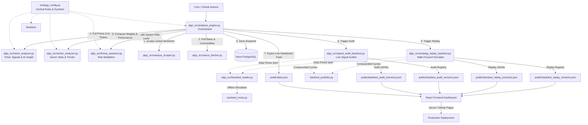

# ASX Short-Term Specialist Terminal (ASX 龙头股短线专家终端)

A high-performance quantitative analysis terminal and backtesting dashboard for ASX leading stocks. This project uses a hybrid serverless/static architecture where a Python analysis engine runs daily, writes structured signals to a secure PostgreSQL database, evaluates historical performance via a backtester, and deploys a fully static React-based frontend dashboard (supporting English & Chinese) with responsive visuals.

---

## 🚀 Key Features (核心功能)

1. **Take-off Breakout Radar (起飞雷达)**
   - Technical pattern breakout recognition crossed with news sentiment scores.
   - Automatically classifies stocks into **Breakout Confirmation (主升浪)** and **Capital Accumulation (潜伏期)** zones.
   - Built-in risk-based automatic signal downgrading to prevent chasing highs near bad news.

2. **Market Heatmap & Analysis (板块热力追踪与诊断)**
   - Computes real-time fund flows, average changes, volume ratios, and sentiment metrics across 12 key ASX sectors.
   - Bloomberg-style interactive detail sidebar displaying matched global risks, catalysts (opportunities/defensive setups), and detailed constituent stock listings.

3. **Global Macro & Intelligence (全球宏观与舆情)**
   - Integrates global macro indicators (10Y US Treasury yields, AUD/USD exchange rates) and financial intelligence scraped from Waneye.com.

4. **Multi-Period & Multi-Version Backtesting (多维度与多参数版本回测)**
   - Calculates historical performance over **1D, 3D, 5D, and 10D holding periods** for both **Stocks** and **Sectors**.
   - Supports two distinct Return Models: **Theoretical (Close-to-Close)** and **Executable (Next Open-to-Close)** with double-side transaction fee penalties.
   - Evaluates **Top-N Equal-Weight Portfolios** compounded equity curves with maximum drawdown metrics.
   - centralizes strategy parameters in a git-fingerprinted `ALGO_VERSION` registry enabling historical backtests selection on the frontend.

5. **Premium UI/UX Design (极简现代暗黑终端)**
   - Highly responsive React frontend with localization tabs (中文 / English) and built-in Vercel Web Analytics.
   - High-fidelity custom SVG holding period return curves and compounded portfolio equity curves.
   - Interactive data-list filters allowing search/select by Ticker, Sector, Signal Date, and Strategy parameters versions.

6. **Real-time Live Analyzer (实时量化多维度诊断探针)**
   - Allows users to input any custom stock ticker (e.g. `TLS.AX`, `BHP.AX` or US stocks like `AAPL`) not restricted to the preset lists.
   - Replicates the Python quantitative engine logic fully in JavaScript (Moving Averages, RSI, Volume Ratio, ATR, and breakout indicators).
   - Features real-time responsive recalculations, rendering interactive SVG K-line charts with overlays, and a dual-source serverless proxy (query1 + query2 failover) to completely bypass CORS and DNS resolution restrictions.

7. **BHB Return Attribution Analysis (基于 BHB 模型的收益归因分析) [NEW]**
   - Orthogonally decomposes signal returns into **Market Beta (大盘被动贡献)**, **Sector Rotation (行业轮动超额)**, **Stock Alpha (个股纯选股实力)**, and **Timing Premium (择时溢价)** components (residual ≈ 0).
   - Computes **Information Ratio (IR)** and **t-statistics** to mathematically determine if returns are driven by reproducible **Skill (能力)** or casual **Luck (运气)**.
   - Highly interactive frontend layout featuring a responsive custom SVG Cumulative curves chart (auto-adjusts to a single-day bar chart when filtered to 1 day) and an active 3-way Drill-down detail table (by Date, Sector, or Stock) with context-aware explanatory guides.


---

## 🛠 Architecture & Tech Stack (系统架构与技术栈)



### Stack Components
* **Frontend**: React (Vite, HSL-tailored vanilla CSS theme, responsive SVG charts, Vercel Web Analytics).
* **Backend**: Python 3 (pandas, numpy, psycopg2-binary, yfinance).
* **Database**: Neon Serverless PostgreSQL.
* **Deployment/Automation**: GitHub Actions (CI/CD) and GitHub Pages / Vercel (Static Web Hosting).
* **Modular Strategy Engine Architecture (`algo_src/`)**:
  - `algo_src/strategy_config.py`: Centralized configuration dictionary (RSI periods, thresholds, transaction fees) and dynamic sector stock symbols listing.
  - `algo_src/analysis_engine.py`: Core orchestrator of daily tasks, news/macro retrieval, database updates, and live JSON feeds.
  - `algo_src/threat_assessor.py`: Evaluates news/threat alerts to compute global risk states and sector modifier penalties/boosts.
  - `algo_src/stock_analyzer.py`: Performs stock-level momentum, accumulation, V-reversals indicators calculations and AI insight generation.
  - `algo_src/sector_analyzer.py`: Aggregates stock signals into sector statistics, and computes 30-day normalized sector trends.
* **Modular Backtester Structure (`algo_src/`)**:
  - `algo_src/signal_audit_backtest.py`: Audits historically generated production signals stored in the database.
  - `algo_src/strategy_replay_backtest.py`: Performs a strict walk-forward historical simulation (strategy replay) of the current quantitative rules using 2-year OHLCV prices, avoiding look-ahead bias.
  - `algo_src/backtest_loader.py`: Safely loads historical daily prices and synchronizes Yahoo Finance downloads.
  - `algo_src/backtest_portfolio.py`: Simulates Top-N rebalancing portfolio performance.
  - `algo_src/backtest_mock.py`: Automatically provides simulation fallbacks in offline environments.


---

## 📦 Getting Started (快速开始)

### Prerequisites
- Python 3.10+
- Node.js 18+
- PostgreSQL database (e.g., Neon.tech)

### 1. Python Engine Setup
1. Clone the repository:
   ```bash
   git clone https://github.com/dwen168/asxscreener101.git
   cd asxscreener
   ```
2. Create and activate a virtual environment:
   ```bash
   python3 -m venv .venv
   source .venv/bin/activate
   ```
3. Install dependencies:
   ```bash
   pip install -r requirements.txt
   ```
4. Set up your environment variables (e.g., in a `.env` file or export directly):
   ```bash
   export DATABASE_URL="your-postgresql-connection-string"
   ```
5. Run the analysis engine to analyze market data, update the database, and generate backtests:
   ```bash
   python algo_src/analysis_engine.py
   ```

### 2. Frontend Setup
1. Install node dependencies:
   ```bash
   npm install
   ```
2. Run the frontend local development server:
   ```bash
   npm run dev
   ```
3. Open `http://localhost:5173` in your browser.
4. To build for production deployment:
   ```bash
   npm run build
   ```

---

## 🗄 Database Schema (数据库表结构)

The database schema is initialized automatically by `db_writer.py` on connection. The key tables are:
- `algo_config_versions`: Tracks versions of quantitative rules, parameters, and commit SHAs.
- `market_snapshots`: Stores daily runs and raw JSON payloads of macro states.
- `sector_signals`: Stores historical daily statistics and signals (`🔥 热点爆发`, `📡 资金潜入`...) for each sector.
- `stock_signals`: Stores historical daily prices, indicators (RSI, Relative Strength), and radar alert signals (`主升浪 ▶`, `潜伏区 ◉`...) for each stock.

---

## 🤖 CI/CD Automation (GitHub Actions 自动任务)

The pipeline is defined in `.github/workflows/update_data.yml` and is configured to run automatically:
* **Pre-market scan (盘前扫描)**: 09:30 AEST (23:30 UTC previous day)
* **Mid-day scan (盘中扫描)**: 12:00 AEST (02:00 UTC)
* **Post-market full run (收盘后分析)**: 17:00 AEST (07:00 UTC)

### Required GitHub Secrets
To configure CI/CD in your repository settings:
- Add `DATABASE_URL`: Connection string to your PostgreSQL instance.

---

## 📜 License
This project is private and proprietary.
