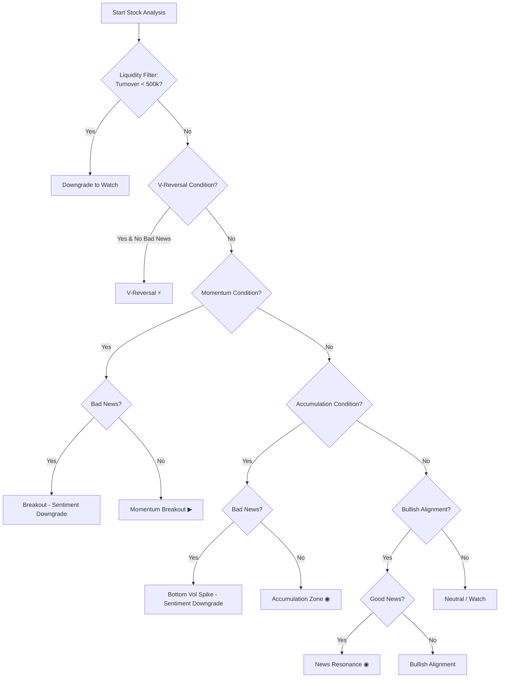

# Algorithm Design Specification: Version v1.2.0-19aa7e71

This document outlines the architecture, mathematical formulas, and quant mechanics of the ASX Screener Algorithm for version **v1.2.0-19aa7e71**.

---

## PART I: CORE CONFIGURATION & VERSIONING

### 1. Centralized Parameter Config (`strategy_config.py`)
The system's behavior is controlled by a central parameters map defining indicators, filters, and transaction costs:

*   **Data Constraints**:
    *   `min_data_len_initial`: 25 trading days minimum (for initial indicators alignment).
    *   `min_data_len_aligned`: 20 trading days minimum (post benchmark index alignment).
*   **Technical Indicators**:
    *   `rsi_period`: 14 days.
    *   `rsi_overbought_threshold`: 75 (triggers warning flags).
    *   `rsi_fallback_value`: 50.0.
    *   `breakout_lookback_days`: 21 days (peak neckline lookback window).
*   **Volatility & Momentum**:
    *   `atr_period`: 14 days.
    *   `atr_pct_threshold`: 2.0% (minimum volatility floor for momentum breakouts).
    *   `momentum_ma_conditions_min`: 2 (minimum required conditions for a momentum trigger).
*   **State-Dependent Thresholds**:
    | Parameter | Default State | Low Risk State |
    | :--- | :--- | :--- |
    | Volume Percentile (`vol_percentile_threshold`) | `0.70` | `0.75` |
    | Accumulation Volume Spike (`accum_spike_threshold`) | `0.80` | `1.00` |
    | Relative Strength Ratio (`rs_threshold`) | `1.01` | `1.03` |
*   **Sentiment Gating & Decay**:
    *   `sentiment_bad_threshold`: -0.15.
    *   `sentiment_good_threshold`: 0.25.
    *   `freshness_bad_threshold`: 0.3.
    *   `freshness_good_threshold`: 0.4.
*   **Liquidity & Turnover Thresholds**:
    *   `turnover_tier2_limit`: AUD 2,000,000.0 (Tier 2: Low Liquidity threshold).
    *   `turnover_tier3_limit`: AUD 500,000.0 (Tier 3: Extremely Low Liquidity threshold).
*   **Simulation Metrics**:
    *   `min_sample_size`: 30 signals.
    *   `transaction_cost_pct`: 0.20% (applied double-sided as 0.40% total transaction cost per trade).
    *   `top_n_portfolio`: Top-5 picks daily.

### 2. Configuration Fingerprints & Version Control
The algorithm version is dynamically computed based on the combination of a base semantic version and an 8-character MD5 hash representing the state of the centralized parameters dictionary (`STRATEGY_CONFIG`):

`Version String = BASE_ALGO_VERSION - MD5(STRATEGY_CONFIG)[:8]`

For this build, the base version is **v1.2.0** and the configuration fingerprint is **19aa7e71**. This guarantees parameter-to-build binding, meaning any modification to thresholds in `strategy_config.py` automatically updates the version string.

---

## PART II: LIVE RECOMMENDATION ENGINE

The Recommendation Engine processes technical, macro, and sentiment data to classify stocks and sectors daily.

### 3. Individual Stock Signal Generation (`stock_analyzer.py`)

#### 3.1 Indicators Calculation
For each stock, the analyzer calculates four key dimensions:
1.  **Trend System (MA)**: Simple Moving Averages are computed for $5$, $10$, $20$, and $60$ trading days.
    ```math
    \text{MA}_{N} = \frac{1}{N}\sum_{i=0}^{N-1} \text{Close}_{t-i}
    ```
2.  **Relative Strength (RS Ratio)**: Evaluated relative to the benchmark index (typically `^AORD` or sector indexes).
    ```math
    \text{RS Ratio}_{Nd} = \frac{1 + \text{Return}_{\text{Stock}, Nd}}{1 + \text{Return}_{\text{Index}, Nd}}
    ```
3.  **Volume Ratio**: The current volume relative to its 20-day historical average.
    ```math
    \text{Volume Ratio} = \frac{\text{Volume}_{t}}{\frac{1}{20}\sum_{i=1}^{20} \text{Volume}_{t-i}}
    ```
4.  **ATR Percentile**: Used to measure current breakout volatility relative to price.
    ```math
    \text{ATR}_{14} = \text{Rolling Max}(\text{High}, 14) - \text{Rolling Min}(\text{Low}, 14)
    ```
    ```math
    \text{ATR Pct} = \frac{\text{ATR}_{14}}{\text{Close}_{t}} \times 100
    ```

#### 3.2 Signal Triggering Rules
During scanning, stocks are classified using the following technical setups:



1.  **Momentum Breakout ▶**
    *   *Required Core*: `breakout` is `True` ($\text{Close}_{t} > \max(\text{High}_{t-1}, \dots, \text{High}_{t-21})$) AND $\text{ATR Pct} > 2.0\%$.
    *   *Auxiliary Conditions*: At least 2 of the following 3 must hold:
        1.  `ma_bullish`: $\text{MA}_{5} > \text{MA}_{10} > \text{MA}_{20}$ and $\text{Close}_{t} > \text{MA}_{5}$.
        2.  `breakout_vol_spike`: Volume percentile $Rank\% > \text{vol\_percentile\_threshold}$ (0.70 default, 0.75 low risk).
        3.  `is_strong`: $\text{RS Ratio}_{5d} > \text{rs\_threshold}$ (1.01 default, 1.03 low risk).
    *   *Exceptions*:
        *   If $\text{RSI} > 75$, flagged as **Momentum Breakout (Overbought) ▶**.
        *   If active bad news is present, signal is downgraded to **Breakout (Sentiment Downgrade)**.
2.  **Accumulation Zone ◉**
    *   *Conditions*:
        1.  `recently_below_ma20`: Stock price crossed below $\text{MA}_{20}$ in the past 10 days (filters out high-flying stocks).
        2.  `accum_vol_spike`: $\text{Volume Ratio} > \text{accum\_spike\_threshold}$ (0.80 default, 1.00 low risk).
        3.  $\text{Change\%}_{t} > 0$ (must close positive on the trigger day).
        4.  $\text{RS Ratio}_{5d} > \text{rs\_threshold}$ (relative strength check).
        5.  `price_above_floor`: Price is stabilized ($\text{Close}_{t} > 60\text{d Low} \times 1.05$).
        6.  `stabilization`: At least 2 up-days out of the last 5 days, OR daily low is rising ($\text{Low}_{t} > \text{Low}_{t-5}$).
    *   *Exceptions*: Downgrades to **Bottom Vol Spike (Sentiment Downgrade)** if active bad news is present.
3.  **V-Reversal ⚡**
    *   *Conditions*:
        1.  Sharp rebound: $\text{Change\%}_{t} > 3.0\%$.
        2.  Deep sell-off context: 5-day return $\text{Change\%}_{5d} < -5.0\%$.
        3.  Significant volume support: $\text{Volume Ratio} > 2.0$.
        4.  Recovers major trendline: $\text{Close}_{t} > \text{MA}_{20}$.
        5.  Must not have bad news.
4.  **News Resonance ◉**
    *   *Conditions*: `ma_bullish` is `True` and `sentiment_value` $> 0.25$ (highly positive news).

#### 3.3 Sentiment NLP Gating & Decay
*   **Sentiment Fusion**: Merges stock-specific Yahoo Finance news sentiment with Waneye scraper sector sentiment. If specific stock news is missing, the sector's general news sentiment is used as a fallback.
*   **Negation Processing**: Text parsing uses long-phrase priority matching and processes negation words to invert polarity.
*   **Freshness Decay Filter**:
    *   Bad news triggers a warning/downgrade only if its freshness score $> 0.3$ (avoids penalizing stock signals for stale negative news).
    *   Good news triggers resonance only if its freshness score $> 0.4$.

#### 3.4 Liquidity & Risk Management (Risk Alert Framework)
*   **Risk Control Principle**: Risk management alerts do not hard-block/melt-down recommendations; instead, they serve as warning indicators to recommend light positions.
*   **Risk States**: Under `low_risk`, `medium_risk`, or `high_risk` market snapshots:
    *   Signals are appended with a caution label: **Momentum Breakout (Light Position)** or **Accumulation Zone (Light Position)**.
    *   Quant thresholds for volume and RS ratios automatically tighten.
*   **Liquidity Downgrades**:
    *   If 20-day average turnover $< \text{AUD } 500\text{K}$, signal is downgraded to **Watch**.
    *   If 20-day average turnover is between $\text{AUD } 500\text{K}$ and $\text{AUD } 2\text{M}$, signal is appended with **(Low Liquidity)** (e.g., **Momentum Breakout (Low Liquidity)**).

---

### 4. Sector-Level Alert Recommendations (`sector_analyzer.py`)

Each sector's metrics are weighted by the relative turnover of its constituent stocks to focus on liquid market leaders.

#### 4.1 Turnover-Weighted Sector Stats
```math
\text{Weight}_{s} = \frac{\text{Turnover}_{s}}{\sum_{k \in \text{Sector}} \text{Turnover}_{k}}
```
```math
\text{Sector Avg Change} = \sum_{s \in \text{Sector}} \text{Change\%}_{s} \times \text{Weight}_{s}
```

#### 4.2 Heat Score Formula
The sector heat score ($0-100$) is computed as follows:

```math
\text{Base Score} = (\text{Avg Change} \times 6) + (\text{Avg Vol Ratio} \times 15) + (N_{\text{momentum}} \times 15) + (N_{\text{accumulation}} \times 10)
```
```math
\text{RS Bonus} = (\text{Avg RS}_{5d} - 1.0) \times 30
```
```math
\text{Capped Base} = \min(70.0, \max(0.0, \text{Base Score} + \text{RS Bonus}))
```
```math
\text{Heat Score} = \min(100, \max(0, \text{Capped Base} + \text{Macro Bonus} + \text{Sent Bonus} - \text{Risk Penalty} + \text{Opportunity Boost}))
```

*   **Macro Bonus**: Adjusts for treasury yield trends and AUD currency strength using sector multipliers:
    *   *Technology / Real Estate*: negative yield coefficient (valuation pressure).
    *   *Banking*: positive yield coefficient (net interest margin expansion).
    *   *Resources / Mining / Energy / Uranium*: positive AUD coefficient.
*   **Capping Principle**: The base technical and RS score is capped at $70.0$ to reserve a $30$-point range for macro overlays, sentiment bonuses, and sector-wide risk penalties.

---

## PART III: BACKTESTING & SIMULATION FRAMEWORKS

The backtest architecture evaluates recommended signals against historical pricing data under realistic execution assumptions.

### 5. Backtest Architecture Matrix

The backtesting system is organized as a 2x3 matrix crossing two **Evaluation Modes** with three **Analysis Dimensions**:

| | Stock Backtest | Sector Backtest | Portfolio Backtest |
| :--- | :--- | :--- | :--- |
| **Signal Audit** | stand-alone performance of live stock signals recorded in production database | performance of component shares after a sector triggers hot or warning signals in production | equity curves and drawdowns of Top-5 signals picked daily from live production database |
| **Strategy Replay** | stand-alone performance of simulated stock signals generated by re-running current rules over 2y history | performance of component shares after a sector triggers hot/warning signals during historical simulation | compounded equity curves and drawdowns of Top-5 signals selected daily by rules over 2y history |

*   **Signal Audit Mode** is calculated by [signal_audit_backtest.py](signal_audit_backtest.py), which reads actual production signals recorded in the database, aligns historical price metrics, retroactively fills Next-Open values, and outputs results to `backtest_audit_[version].json`.
*   **Strategy Replay Mode** is calculated by [strategy_replay_backtest.py](strategy_replay_backtest.py), which runs a dynamic walk-forward historical simulation to generate simulated signals over a 2-year sliding price index, writing outputs to `backtest_replay_[version].json`.

---

### 6. Backtest Metric Calculations

#### 6.1 Stock Signal Backtest
*   **Holding Windows**: Stand-alone returns are evaluated over holding periods of $1$, $3$, $5$, and $10$ trading days post-signal.
*   **Theoretical Returns (Close-to-Close)**:
    Purchased at the close price of the signal date $t$, and sold at the close price of day $t+N$:
    ```math
    \text{Return}_{\text{theo}, Nd} = \frac{\text{Close}_{t+N} - \text{Close}_{t}}{\text{Close}_{t}} \times 100
    ```
*   **Executable Returns (Next Open-to-Close)**:
    Purchased at the open price of the next trading day $t+1$, and sold at the close price of day $t+N$ to simulate realistic execution slippage:
    ```math
    \text{Return}_{\text{exec}, Nd} = \frac{\text{Close}_{t+N} - \text{Open}_{t+1}}{\text{Open}_{t+1}} \times 100
    ```
*   **Transaction Cost Deduction**:
    A double-sided transaction cost of $0.40\%$ ($\text{Double Cost}$) is subtracted from both gross returns and alpha calculations to yield Net metrics:
    ```math
    \text{Return}_{\text{net}} = \text{Return}_{\text{gross}} - \text{Double Cost}
    ```
    ```math
    \text{Alpha}_{\text{net}} = (\text{Return}_{\text{gross}} - \text{Return}_{\text{benchmark}}) - \text{Double Cost}
    ```

#### 6.2 Sector Signal Backtest
To avoid methodology bias and provide a clear picture of performance, sector-level returns are calculated using a **Dual-Return Methodology**:

*   **Sector Broad Return (全成分收益)**: The baseline average daily return of *all* active constituent stocks within the sector, simulating a passive sector index hold.
    ```math
    \text{Broad Return}_{t} = \frac{1}{K} \sum_{s \in \text{All Sector Stocks}} \text{Return}_{s, t}
    ```
*   **Sector Triggered Subset Return (共振子集收益)**: The average daily return of only the specific subset of stocks that simultaneously triggered momentum/accumulation signals when the sector itself fired a signal. This isolates the strategy's stock-picking edge during sector rotations.
    ```math
    \text{Subset Return}_{t} = \frac{1}{J} \sum_{s \in \text{Triggered Stocks}} \text{Return}_{s, t}
    ```
*   **Holding Windows & Cost Deduction**: Both broad and subset returns are evaluated over holding windows of $1$, $3$, $5$, and $10$ trading days post-sector signal trigger. A double-sided $0.40\%$ fee is subtracted to calculate net average returns.

#### 6.3 Portfolio Simulation Backtest (`backtest_portfolio.py`)
This simulates a real, capital-constrained trading account implementing the strategy daily. Both engines leverage `backtest_portfolio.py` to run this simulation.

1.  **Candidate Selection**: On each signal date, active signals are sorted by their `composite_score` in descending order:
    `Composite Score = heat_score + vol_ratio + rs_ratio_5d`
    The Top-5 (`top_n=5`) stock signals are selected for portfolio rebalancing.
2.  **Asset Allocation**: Capital is divided equally ($20\%$ per stock).
3.  **Compounding Equity Curve**: The daily portfolio equity compounds forward:
    ```math
    \text{Equity}_{t} = \text{Equity}_{t-1} \times \left(1 + \frac{\sum_{i=1}^{M} \text{Return}_{i} - \text{Double Cost}}{M}\right)
    ```
    *   $M$: Sample size of valid assets selected.
    *   $\text{Double Cost}$: Total transaction friction of $0.4\%$ ($0.2\%$ buy, $0.2\%$ sell).
4.  **Evaluation Metrics**: Evaluated over holding windows of $1$, $3$, $5$, and $10$ days.
5.  **Return Type Configurations**:
    *   **Theoretical Returns**: Calculations use Close-to-Close returns.
    *   **Executable Returns**: Calculations use next-day Open-to-Close returns, simulating a more realistic execution window.
